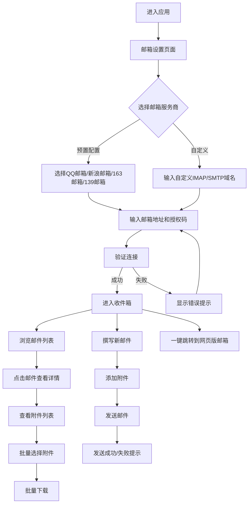

## 1. 产品概述
简易邮箱客户端是一款基于Web的轻量级邮件管理工具，支持通过授权码连接多种主流邮箱服务商，提供收件、发件和附件批量下载功能。
- 主要目的：为用户提供一个统一的邮件管理界面，无需登录多个邮箱网页
- 目标用户：需要管理多个邮箱账户的个人用户和办公人士

## 2. 核心功能

### 2.1 用户角色
| 角色 | 注册方式 | 核心权限 |
|------|----------|----------|
| 普通用户 | 无需注册 | 配置邮箱、收发邮件、下载附件 |

### 2.2 功能模块
1. **邮箱设置页面**：选择预置邮箱服务商或自定义配置，输入授权码
2. **收件箱页面**：查看邮件列表、阅读邮件详情、批量选择邮件
3. **发件箱页面**：撰写新邮件、添加附件、发送邮件
4. **附件管理**：批量下载邮件中的附件文件

### 2.3 页面详情
| 页面名称 | 模块名称 | 功能描述 |
|----------|----------|----------|
| 邮箱设置 | 服务商选择 | 内置QQ邮箱、新浪微博邮箱、163邮箱、139邮箱等预置配置 |
| 邮箱设置 | 自定义配置 | 支持自定义IMAP/SMTP服务器域名和端口 |
| 邮箱设置 | 授权码输入 | 输入邮箱授权码进行账户验证 |
| 收件箱 | 邮件列表 | 显示收件箱邮件列表，支持分页和搜索 |
| 收件箱 | 邮件详情 | 查看邮件完整内容，包括附件列表 |
| 收件箱 | 批量操作 | 支持批量选择邮件，批量下载附件 |
| 发件箱 | 邮件撰写 | 支持HTML格式邮件，可添加多个附件 |
| 发件箱 | 发送功能 | 通过SMTP协议发送邮件 |
| 快捷跳转 | 网页入口 | 一键跳转到当前邮箱服务商的网页版 |

## 3. 核心流程

用户配置邮箱账户 → 验证授权码 → 查看收件箱邮件 → 阅读邮件 → 批量下载附件 → 撰写并发送新邮件

## 4. 用户界面设计

### 4.1 设计风格
- 主色调：深蓝色系（#1e3a5f）搭配浅蓝色点缀（#3b82f6）
- 按钮样式：圆角矩形，悬停时有渐变效果
- 字体：使用系统字体，标题加粗，正文清晰易读
- 布局：左侧导航栏 + 右侧内容区的经典邮箱布局
- 图标：使用简洁的SVG图标

### 4.2 页面设计概述
| 页面名称 | 模块名称 | UI元素 |
|----------|----------|--------|
| 邮箱设置 | 服务商选择 | 卡片式选择，图标+名称 |
| 邮箱设置 | 配置表单 | 输入框、密码框、下拉选择 |
| 收件箱 | 邮件列表 | 列表项包含发件人、主题、预览、时间 |
| 收件箱 | 邮件详情 | 邮件头部、正文区域、附件列表 |
| 发件箱 | 邮件撰写 | 收件人、主题、正文编辑器、附件区域 |

### 4.3 响应式设计
- 桌面优先设计，支持1024px以上分辨率
- 中等屏幕（768px-1024px）：自适应布局
- 小屏幕（<768px）：折叠导航栏，单列布局

### 4.4 交互细节
- 邮箱设置保存后自动验证连接状态
- 邮件列表支持点击展开/折叠预览
- 附件下载有进度提示
- 邮件发送状态实时反馈