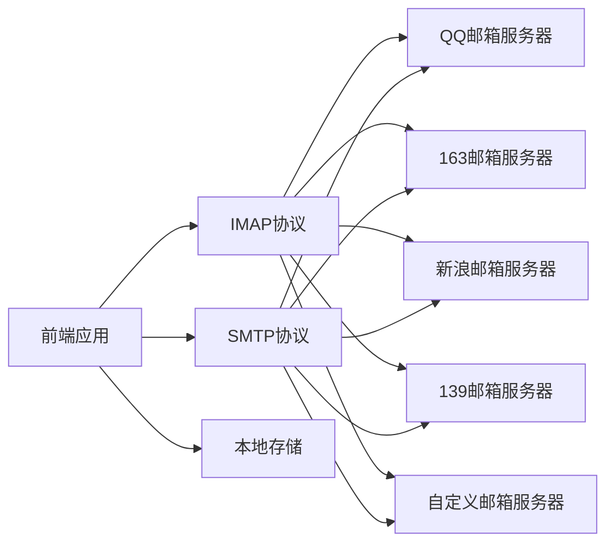

## 1. 架构设计



## 2. 技术描述
- 前端：React@18 + TailwindCSS@3 + Vite
- 初始化工具：vite create react
- 后端：无（纯前端应用，直接连接邮件服务器）
- 邮件协议：IMAP用于接收邮件，SMTP用于发送邮件
- 数据库：使用浏览器LocalStorage存储邮箱配置
- 第三方库：imap（IMAP协议）、nodemailer（SMTP协议）、mailparser（邮件解析）

## 3. 路由定义
| 路由 | 用途 |
|------|------|
| / | 邮箱设置页面（首次访问） |
| /inbox | 收件箱页面 |
| /compose | 撰写邮件页面 |

## 4. API定义

由于是纯前端应用，不涉及后端API，直接通过IMAP/SMTP协议与邮件服务器通信。

### 4.1 预置邮箱配置
| 服务商 | IMAP服务器 | IMAP端口 | SMTP服务器 | SMTP端口 | 网页地址 |
|--------|-----------|----------|------------|----------|----------|
| QQ邮箱 | imap.qq.com | 993 | smtp.qq.com | 465 | https://mail.qq.com |
| 163邮箱 | imap.163.com | 993 | smtp.163.com | 465 | https://mail.163.com |
| 新浪邮箱 | imap.sina.com | 993 | smtp.sina.com | 465 | https://mail.sina.com.cn |
| 139邮箱 | imap.139.com | 993 | smtp.139.com | 465 | https://mail.10086.cn |

### 4.2 配置数据结构
```typescript
interface EmailConfig {
  id: string;
  provider: string;
  email: string;
  password: string;
  imapHost: string;
  imapPort: number;
  smtpHost: string;
  smtpPort: number;
  webUrl: string;
}
```

### 4.3 邮件数据结构
```typescript
interface Email {
  id: string;
  from: { name: string; address: string };
  to: { name: string; address: string }[];
  subject: string;
  body: string;
  htmlBody: string;
  attachments: Attachment[];
  date: Date;
  read: boolean;
}

interface Attachment {
  id: string;
  filename: string;
  contentType: string;
  size: number;
  content: string;
}
```

## 5. 模块划分

### 5.1 组件模块
- Sidebar：侧边导航栏
- EmailList：邮件列表
- EmailDetail：邮件详情
- ComposeEmail：撰写邮件
- Settings：邮箱设置
- AttachmentList：附件列表

### 5.2 服务模块
- emailService.ts：邮件服务（IMAP接收、SMTP发送）
- storageService.ts：本地存储服务
- configService.ts：邮箱配置服务

### 5.3 工具模块
- emailParser.ts：邮件解析工具
- attachmentDownloader.ts：附件下载工具

## 6. 数据存储

使用浏览器LocalStorage存储：
- 邮箱配置信息（加密存储授权码）
- 用户偏好设置
- 已读邮件标记

## 7. 安全考虑

- 授权码使用base64加密存储
- 不记录明文密码
- 仅在内存中保存活跃会话
- 定期清理过期会话